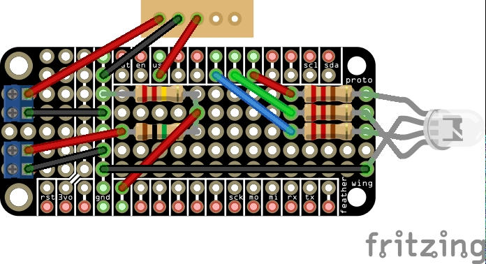

# Battery Monitor

[Overview](#overview)  
[Operation](#operation)  
[WiFi Firmware Update](#wifi-firmware-update)  
[Shield Design](#shield-design)

## Overview

This project is a battery monitor that reports a battery's current voltage on a regular interval to a remote API that can capture trends, send alerts, etc. It contains two components:

| Component | Purpose                          |
| --------- | -------------------------------- |
| Sender    | An Arduino-based voltage monitor |
| Receiver  | TBD                              |

## Operation

### Startup

When the unit is powered on, it will attempt to establish a wifi connection.

| Sequence            | Meaning                    |
| ------------------- | -------------------------- |
| Blue, Blue, Blue    | Attempting wifi connection |
| Green, Green, Green | Connected to wifi          |
| Red, Red, Red       | Failed to connect to wifi  |

### Monitoring

After startup, the unit will sample the battery voltage on an interval and attempt to report the voltage to the remote endpoint.

| Sequence       | Meaning                       |
| -------------- | ----------------------------- |
| Green, Green   | >80% voltage                  |
| Yellow, Yellow | 60-80% voltage                |
| Red, Red       | <60% voltage                  |
| Blue, Green    | Successfully reported voltage |
| Blue, Red      | Failed to report voltage      |

## WiFi Firmware Update

1. Open the sketch Examples > WiFi101 > FirmwareUpdater
2. Add `WiFi.setPins(8,7,4,2);` in `setup()` after the serial port is initialized
3. Upload the sketch
4. Go to Tools > WiFi101 / WiFiNINA Firmware Updater
5. Select port and click Test Connection
6. Select firmware and click Update Firmware

## Shield Design

